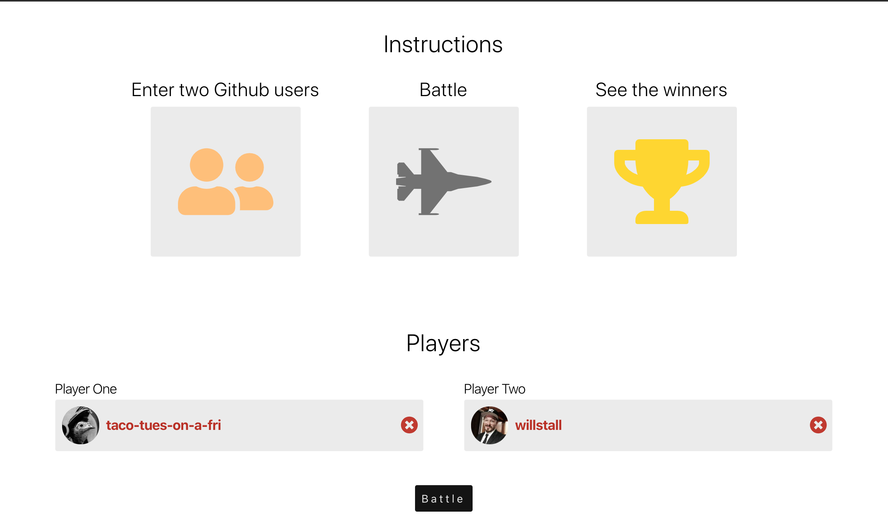
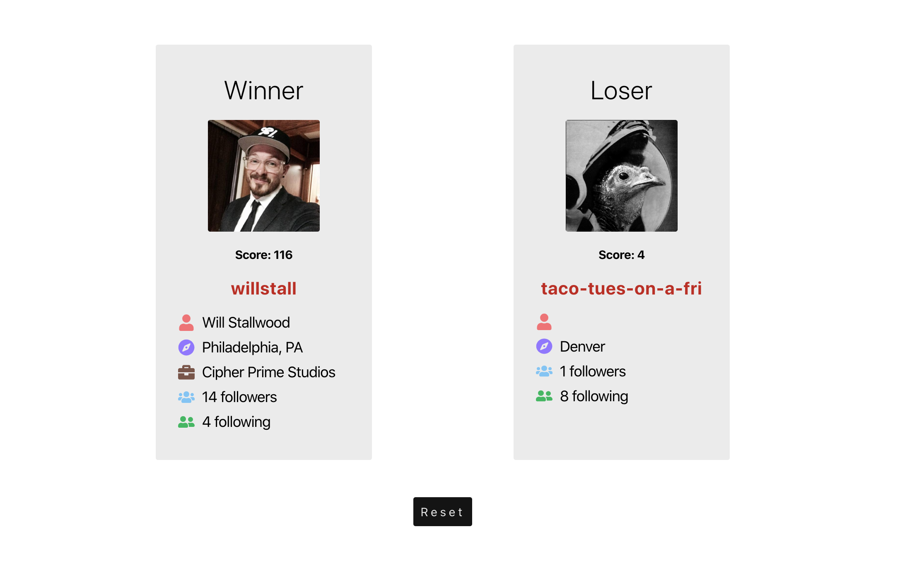
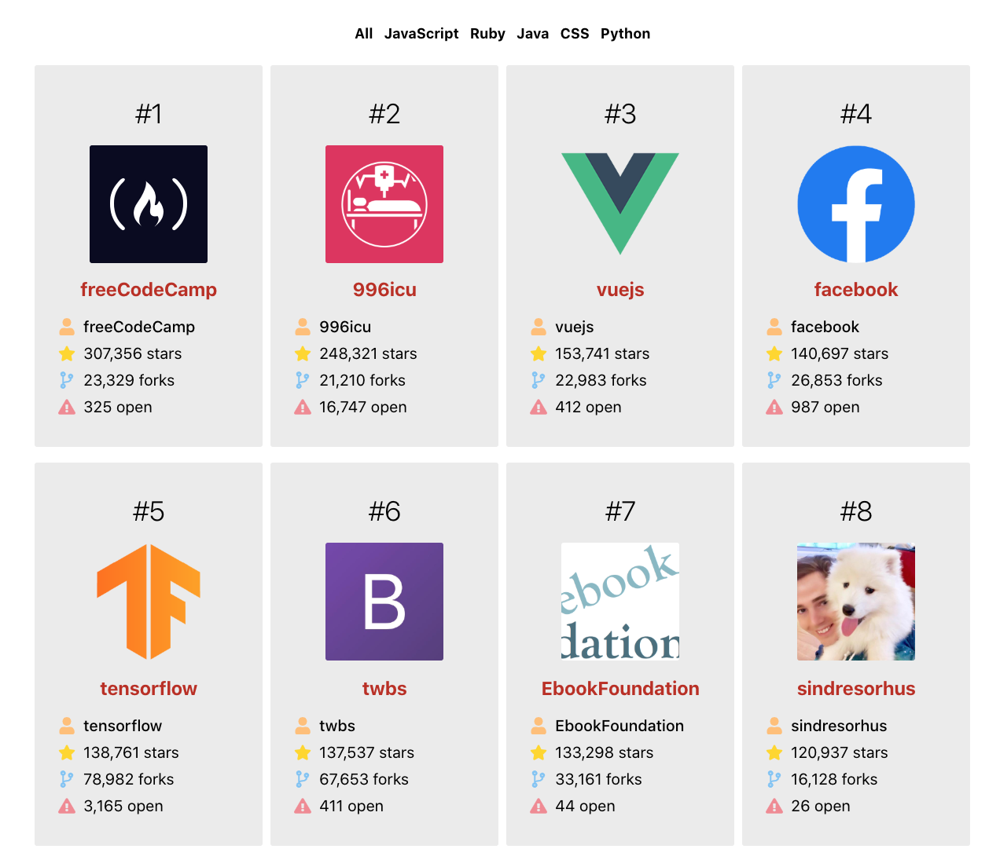

Github Battle
========
Nov 2019 - Present
------------------

## Dynamic web application which displays the most popular Github repositories and compares user statistics in a battle format.

### Overview:
Created by following [Tyler McGinnis' React Tutorial](https://tylermcginnis.com/courses/react/). The application requests repository and user profile data from Github's API then renders dynamic content with the response.  The battle component compares statistics for two specified users then calculates a winner based on stars and followers.

### State of project:
The project is still under development in the tutorial.

#### 🌮taco-tues-on-a-fri