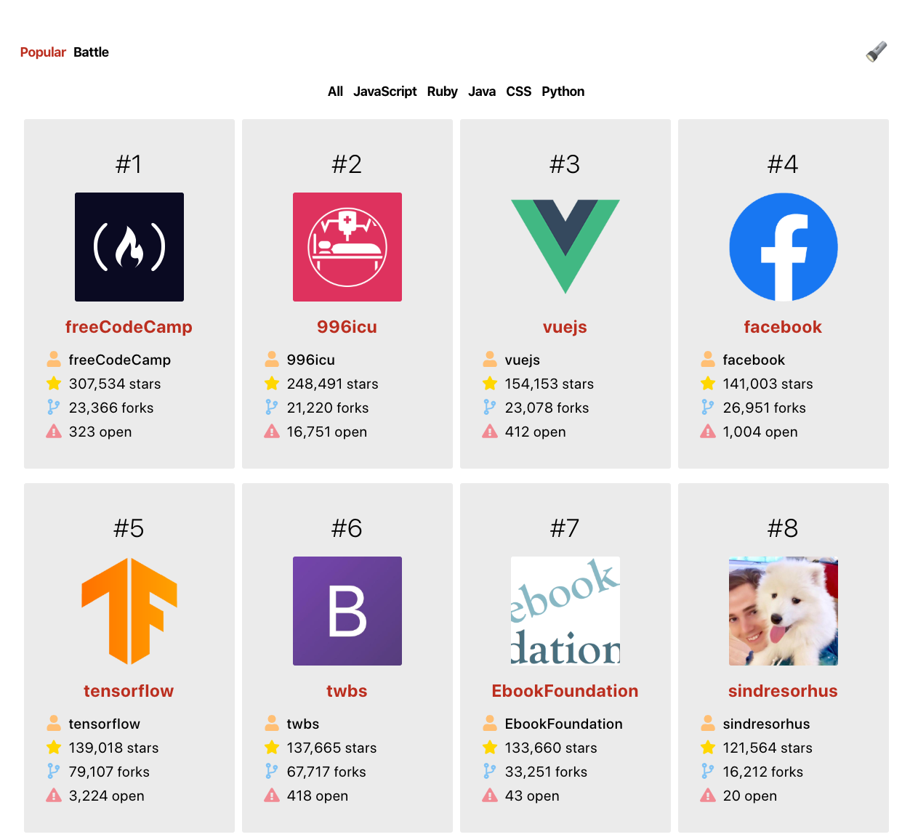

Github Battle
========
November 2019 - December 2019
------------------

## Dynamic web application which displays the most popular Github repositories and compares user statistics in a battle format.

[Try out live application](https://cocky-babbage-a6d8c1.netlify.com/)
### Overview:
Created by following [Tyler McGinnis' React Tutorial](https://tylermcginnis.com/courses/react/). The application requests repository and user profile data from Github's API then renders dynamic content with the response.  The battle component compares statistics for two specified users then calculates a winner based on stars and followers.

### State of project:
This project is complete.

---

---

---

---

---

#### 🌮taco-tues-on-a-fri 